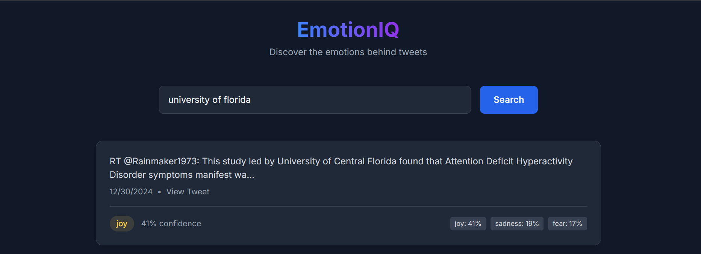
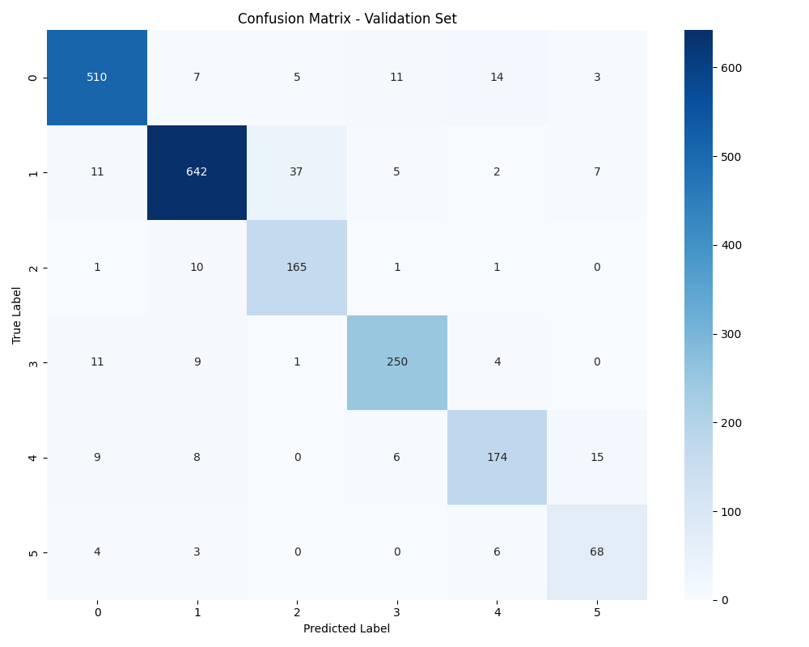
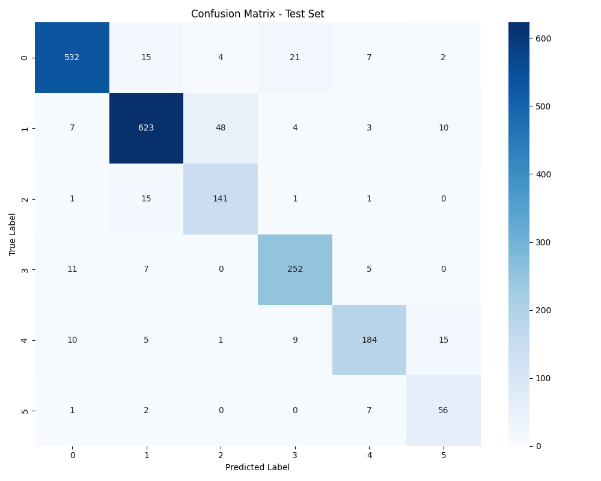

# EmotionIQ - Sentiment and Emotion Analysis of Tweets

EmotionIQ is a Flask-based web application that performs sentiment and emotion analysis on tweets. The application leverages machine learning models and the Tweepy API to classify emotions such as joy, sadness, love, anger, and fear in tweets. It features an interactive frontend built with Tailwind CSS and integrates a custom-trained model for accurate emotion detection.

Model achieves 90% test accuracy and 89% Macro-F1 score, leveraging TF-IDF vectorization, logistic regression, SMOTE for imbalance handling, and GridSearchCV for hyperparameter tuning. 

---

## Features

- **Emotion Classification**: Classifies text into five emotions: joy, sadness, love, anger, and fear.
- **Twitter Query Search**: Fetches recent tweets based on user-defined search queries and analyzes their emotions.
- **Dynamic UI**: Provides a responsive web interface with live updates of emotion analysis results.
- **Custom Trained Model**: Utilizes a custom logistic regression model trained on a labeled dataset.
- **Real-Time Insights**: Displays top emotion predictions with confidence scores for each tweet.

---

## Project Structure

- **Backend**: Flask application with REST API endpoints for emotion classification and Twitter search functionality.
- **Frontend**: Built using Tailwind CSS for responsiveness and dynamic design.
- **Model**: Logistic regression model trained on labeled text datasets for accurate emotion detection.
- **API**: Tweepy API integration to fetch and analyze live tweets.

---
## Demo

## Confusion Matrices for ML Model

